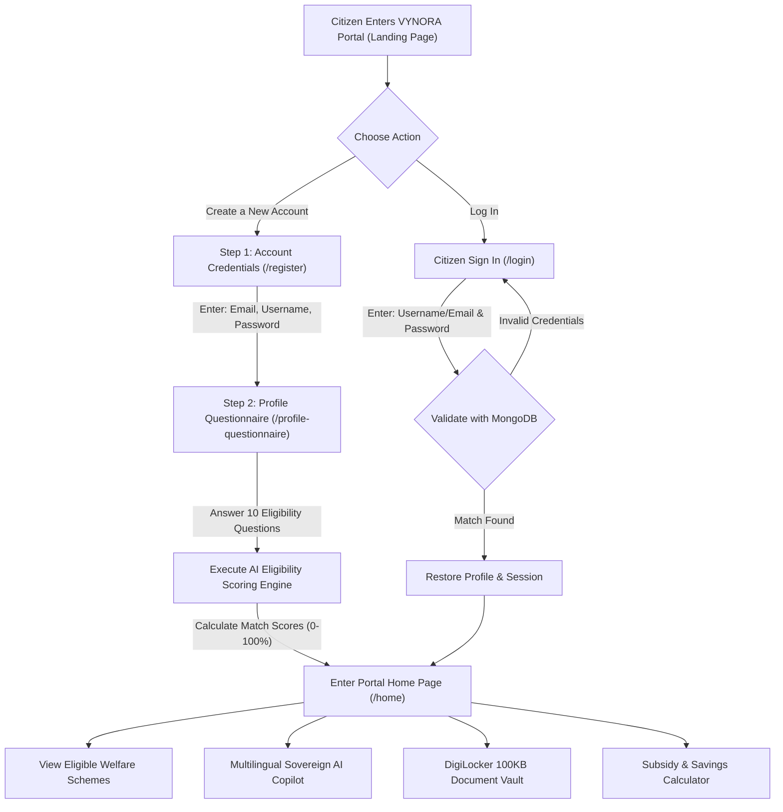

 🏛️ VYNORA: Master Prompt & Architectural Specification
## Full-Stack MERN Government Welfare Schemes Platform with Multilingual AI Copilot

---

### 1. Executive Summary & Project Purpose
**VYNORA** is a production-grade, citizen-centric **MERN Stack (MongoDB, Express, React, Node.js)** platform designed to eliminate information asymmetry and bureaucracy in accessing Indian Central and State Government welfare initiatives.

The platform provides:
- **Precision Eligibility Engine**: Calculates dynamic match scores (0–100%) based on citizen demographic, income, and occupational attributes.
- **Sovereign Multilingual AI Copilot**: Internal, fast, zero-external-API AI advisor natively trained in **6 languages** (English [Primary], Tamil, Telugu, Kannada, Malayalam, Hindi).
- **DigiLocker Document Vault & 100KB Compressor**: Client-side canvas compression ensuring identity and income proofs meet strict government portal file limits (< 100 KB).
- **Anti-Phishing Scheme Link Verifier**: Proactively identifies authentic `.gov.in`/`.nic.in` portals versus fraudulent WhatsApp/Telegram scam links.
- **DBT & Subsidy Calculator**: Real-time financial calculations for PMAY housing interest subsidies, PM Surya Ghar rooftop solar ROI, and MUDRA business loans.

---

### 2. Exact User Workflow & Onboarding Architecture



#### A. Entry Screen
Upon entering the portal, the citizen is greeted with two distinct, prominent actions:
1. **Create a New Account** (`/register`)
2. **Log In** (`/login`)

---

#### B. Create a New Account Workflow
1. **Step 1 — Registration Form (`/register`)**:
   - **Email ID**: Validated email address.
   - **Username**: Unique citizen identifier.
   - **New Password & Confirm Password**: Minimum 6 characters with instant validation.
   - Submitting Step 1 persists credentials to MongoDB (`POST /api/auth/register`) and automatically transitions the citizen to Step 2.

2. **Step 2 — Citizen Eligibility Questionnaire (`/profile-questionnaire`)**:
   The citizen answers 10 structured demographic and financial questions:
   1. **Full Legal Name** (`name`) — text input.
   2. **Annual Income** (`annualIncome`) — `<input type="text">` supporting numbers (e.g. `250000`) or standard Indian denominations (e.g. `2.5 Lakhs`).
   3. **House Type** (`houseType`) — `Owned` or `Rental`.
   4. **Gender** (`gender`) — `Male`, `Female`, or `Other`.
   5. **Address** (`address`) — Residential Street, District, and Pincode.
   6. **State / Union Territory** (`state`) — Dropdown of all 36 Indian States & UTs.
   7. **Native Language** (`nativeLanguage`) — `English` (Primary Default), `Tamil`, `Telugu`, `Kannada`, `Malayalam`, `Hindi`.
   8. **Community / Category** (`community`) — `General`, `OBC`, `SC`, `ST`, `EWS`.
   9. **Religion** (`religion`) — `Hindu`, `Muslim`, `Christian`, `Sikh`, `Buddhist`, `Jain`, `Other`.
   10. **Student or Working People** (`occupationStatus`) — `Student`, `Working Professional`, `Self-Employed`, `Farmer`, `Artisan`, `Unemployed`.

3. **Step 3 — Eligibility Calculation & Portal Access**:
   - Submitting the questionnaire executes the **Multi-Factor Weighted Eligibility Engine**.
   - Profile data is saved to MongoDB (`PUT /api/users/profile`).
   - The user is seamlessly navigated to the **Home Page (`/home`)**, displaying schemes ranked by match score with personalized eligibility tags.

---

#### C. Citizen Login Workflow (`/login`)
1. Citizen enters **Username** (or Email ID) and **Password**.
2. Credentials are verified against MongoDB (`POST /api/auth/login`) using bcrypt hash comparison.
3. On successful authentication, a JWT session token is issued, previous citizen profile attributes are loaded, and the user enters the portal (`/home`).

---

### 3. Multilingual Engine & AI Copilot Training (6 Languages)

#### A. Primary Language Rule
- **English** is the primary default language across the UI, navigation, and AI responses.
- Translation occurs **only when explicitly requested by the citizen** via:
  1. **Navbar / Copilot Language Dropdown**: Switch between English, தமிழ் (Tamil), తెలుగు (Telugu), ಕನ್ನಡ (Kannada), മലയാളം (Malayalam), and हिंदी (Hindi).
  2. **Copilot Conversational Prompts**: Asking queries such as *"translate in Hindi"*, *"tell me in Tamil"*, *"Telugu lo cheppandi"*, *"explain in Kannada"*, or typing in native Indic scripts triggers dynamic language switching automatically.

#### B. 6-Language Knowledge Matrix & Training

| Language | Local Script | Primary Welfare Domains Trained |
| :--- | :--- | :--- |
| **English** *(Primary)* | Latin | Central Schemes (PMAY, Surya Ghar, MUDRA, PMIS 2026, Ayushman Bharat, NSP, PMSBY, PMJJBY, Vishwakarma). |
| **Tamil** | தமிழ் | Kalaignar Magalir Urimai Thogai, Pudhumai Penn, Tamil Pudhalvan, Naan Mudhalvan, CMCHIS, TNHB, TNEB Free Power. |
| **Hindi** | हिंदी | PM Awas Yojana, PM Surya Ghar Muft Bijli, PM Kisan Samman Nidhi, Ayushman Bharat, MUDRA Shishu/Kishore/Tarun. |
| **Telugu** | తెలుగు | Housing Subsidies, Rooftop Solar 300 Units, Student Scholarships, MSME Loans, Rythu Welfare. |
| **Kannada** | ಕನ್ನಡ | Gruha Jyothi, Yuva Nidhi, Housing Assistance, Rooftop Solar Subsidies, PM Vishwakarma Toolkit. |
| **Malayalam** | മലയാളം | Health Insurance, Skill Certifications, Solar Rooftop, Higher Education Scholarships, MSME Credit. |

---

### 4. Technical Architecture & Database Schema

#### A. Architecture Stack
- **Frontend (`/client`)**: React 18, Vite, React Router DOM v6, TailwindCSS, Lucide React Icons, Context API (`AuthContext`).
- **Backend (`/server`)**: Node.js, Express.js (ES Modules), JWT Authentication, bcryptjs, CORS, dotenv.
- **Database**: MongoDB using Mongoose ODM with connection string `MONGO_URI`.

#### B. MongoDB User Schema (`server/models/User.js`)
```javascript
const userSchema = new mongoose.Schema({
  // Authentication
  email: { type: String, required: true, unique: true, lowercase: true },
  username: { type: String, required: true, unique: true, trim: true },
  password: { type: String, required: true, select: false },

  // Questionnaire Attributes
  name: { type: String, trim: true },
  annualIncome: { type: String, trim: true },
  houseType: { type: String, enum: ['Owned', 'Rental', ''] },
  gender: { type: String, enum: ['Male', 'Female', 'Other', ''] },
  address: { type: String, trim: true },
  state: { type: String, trim: true },
  nativeLanguage: {
    type: String,
    enum: ['English', 'Tamil', 'Telugu', 'Kannada', 'Malayalam', 'Hindi'],
    default: 'English'
  },
  community: { type: String, trim: true },
  religion: { type: String, trim: true },
  occupationStatus: {
    type: String,
    enum: ['Student', 'Working Professional', 'Self-Employed', 'Farmer', 'Artisan', 'Unemployed', '']
  },

  profileCompleted: { type: Boolean, default: false },
}, { timestamps: true });
```

---

### 5. API Endpoints Reference

| Method | Endpoint | Description |
| :--- | :--- | :--- |
| `POST` | `/api/auth/register` | Register new user with Email, Username, and Password. |
| `POST` | `/api/auth/login` | Authenticate user with Username/Email and Password. |
| `GET` | `/api/auth/me` | Fetch authenticated citizen session. |
| `GET` | `/api/users/profile` | Retrieve citizen profile questionnaire attributes. |
| `PUT` | `/api/users/profile` | Update citizen questionnaire data & calculate eligibility. |
| `GET` | `/api/schemes` | Fetch 50+ verified Central & State schemes catalog. |
| `POST` | `/api/copilot/chat` | Query Sovereign Multilingual AI Copilot (6 languages). |
| `POST` | `/api/copilot/verify-link` | Audit link safety (.gov.in vs phishing alert). |
| `POST` | `/api/copilot/audit-doc` | Check document clarity and 100 KB readiness. |
| `GET` | `/api/health` | Service health status endpoint. |

---

### 6. Verification and Execution Guide

#### Running the Platform Locally:
```bash
# 1. Install all dependencies across root, client, and server
npm run install-all

# 2. Configure server/.env
PORT=5000
CLIENT_URL=http://localhost:5173
MONGO_URI=mongodb://localhost:27017/govt-schemes
JWT_SECRET=your_secret_key_here

# 3. Start development servers concurrently
npm run dev
```

- **Frontend Client**: `http://localhost:5173`
- **Backend API**: `http://localhost:5000`
- **API Health**: `http://localhost:5000/api/health`
